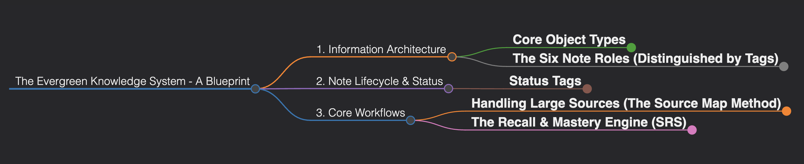

# Designing a Personal Knowledge Management System

  <em>Click the image above to explore the full interactive mindmap.</em>

### The Goal
To design a complete, long-term knowledge management and recall system within a networked thought app (Capacities). The system needed to handle different types of notes, be scalable, and include a proactive, spaced repetition strategy for recall. The final system was designed over a 3-hour collaborative session with an AI.

---

### The Retrospective: A Tale of Two Paths

This analysis compares the actual journey of discovery with a more strategic, optimized approach.

#### **The Actual Path: An Evolutionary Journey**

The final system was developed over a long, iterative conversation of approximately 14 distinct prompts. The process began with a simple request and evolved as new problems and edge cases were discovered and solved one by one.

**The Actual Prompts Used (Chronological):**

1.  "Give me a system with three types of notes (running, own-words, consolidation) with tags and categories..."
2.  "Am I getting it right?" (A re-statement of the proposed flow to confirm understanding).
3.  "What if I encounter different aspects of the same topic? Should I use one note or create variations?"
4.  "I also want to have a recall notes... is there a better design to include this aspect as well?"
5.  "Now the journal note will become a very large note, should we have each journal entry in a single page?"
6.  "When should I be using #status/evergreen?"
7.  "Confirming my understanding of status/processing and status/processed tags."
8.  "Give me a complete lifecycle account for all six note types."
9.  "I have some final questions..." (Clarifying the use of #type/map vs #subtype/map, map creation process, and final recall strategy).
10. "I've discovered new inbuilt features in Capacities... how to integrate them?"
11. "So you are saying that for concept, map and insight I should use atomic note as data type and for the source, recall-entry and learning journal I should use the basic data type which is page?"
12. "How do I handle a source that is huge, like a full course?"
13. "Cool now update the guide and give me new guide map and mindmap"
14. "Give me a mindmap of the final version... and also a strategy to store these kinds of overarching things [like the guide itself]."

This path, while successful, was inefficient and required many course corrections.

#### **The Optimized Path: A Goal-Oriented Blueprint**

Using the design patterns from our framework, the same outcome could have been achieved in just 3-4 highly-strategic prompts.

**Optimized Prompt 1: The Blueprint**
> *"I need to design a complete knowledge management and learning system in Capacities. My primary goal is long-term retention and the ability to generate novel insights. The system must include: 1. A way to capture raw notes from diverse sources (including large ones like books and courses). 2. A method to synthesize these into permanent, atomic concepts. 3. A dedicated process for Active Recall based on Spaced Repetition principles, including tracking recall strength and due dates. 4. A solution for logging individual recall attempts over time without cluttering my main graph view. Please design the complete system, including the necessary Object Types, Tags, and core Workflows."*

**Optimized Prompt 2: The Tool Integration**
> *"This is a great foundation. Now, let's optimize it for Capacities. The tool has inbuilt object types like `Atomic Note`, `Idea`, and `Organisation`. How should we best leverage these native features to simplify our custom system? Should any of our custom object types be replaced by these new defaults?"*

**Optimized Prompt 3: The Final Deliverable**
> *"This is perfect. Please consolidate our final, optimized system into a comprehensive guide written as a standalone 'Standard Operating Procedure' document. It should also include a Markmap mindmap that visualizes the entire framework."*

---

### Key Takeaways & Patterns Applied

*   **The Blueprint Pattern:** The power of this pattern is undeniable. The single "Blueprint" prompt in the optimized path addressed nearly 80% of the edge cases that took over 10 prompts to solve in the actual path.
*   **The Layered Abstraction Pattern:** The ideal journey moved from high-level system design (`Prompt 1`) to tool-specific implementation (`Prompt 2`), showing the power of a structured, top-down approach.
*   **The Self-Critique Pattern:** This entire case study is an exercise in critique and refinement. The ability to look back at a process and identify a better path is a crucial skill in any knowledge-based field.
